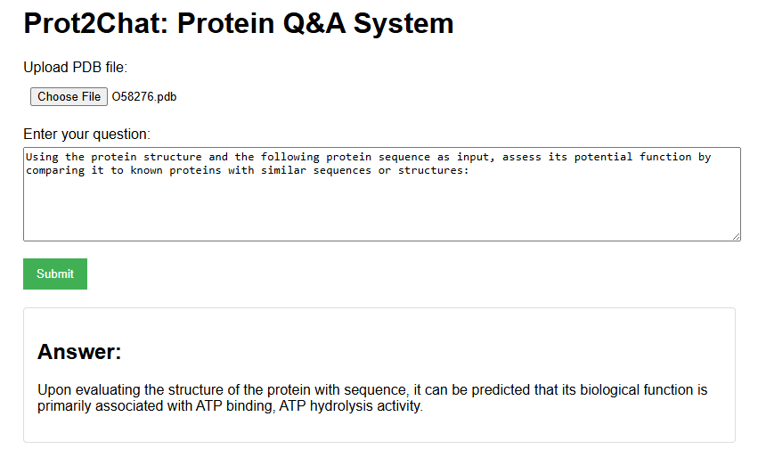

# Prot2Chat

Welcome to Prot2Chat repository!

Paper: https://arxiv.org/abs/2502.06846

Here is a quick tutorial for the Prot2Chat protein Q&A system, which enables you to obtain information about proteins through an interactive Q&A mode on the web page.


## Enviroment installation

### Create a virtual environment

```
conda create -n prot2chat python=3.9
conda activate prot2chat
```

Then clone our project:

```
git clone https://github.com/wangzc1233/Prot2Chat.git
```

### Install packages

You should replace the `/your/path/to/prot2chat` to your own path to `prot2chat` directory.

```
cd /your/path/to/prot2chat
bash requirement.sh
```

## Prepare the models

Download base_model_weight from  https://drive.google.com/file/d/1UgzkSda2wJew95FrVfF246IilB5ekTSc/view?usp=drive_link; 

Download new adapter_weight and lora_weight from https://drive.google.com/file/d/1vb4K2oufxzyS5BeO25hyaJBY9hqR7dn4/view?usp=drive_link. (It also includes the modified ProteinMPNN we used.)


Don't forget to place the downloaded model and weight files in the specified folders. For example, put the ProteinMPNN in `prot2chat/ProteinMPNN`.
## Prepare input data

We have provided several PDB file(providing protein structure and sequence information) samples in `/pdbs`, and some question - answer samples in `/QA_data`. You can also use your own protein file and Q&A data.


## Run Prot2Chat in Web

### Use `demo.py`

You should replace the `/your/path/to/prot2chat` to your own path to `prot2chat` directory.

```
cd /your/path/to/prot2chat
python demo.py --model_path your_path_to_base_model_weight --lora_path your_path_to_lora_weight --adapter_path your_path_to_adapter_weight --port your_port_ID --gpu your_GPU_IDs
```

**After a successful run, access `http://localhost:your_port_ID/` in your local browser. The effect is as follows:**


**Select a protein PDB file and enter your question to get an answer.**


